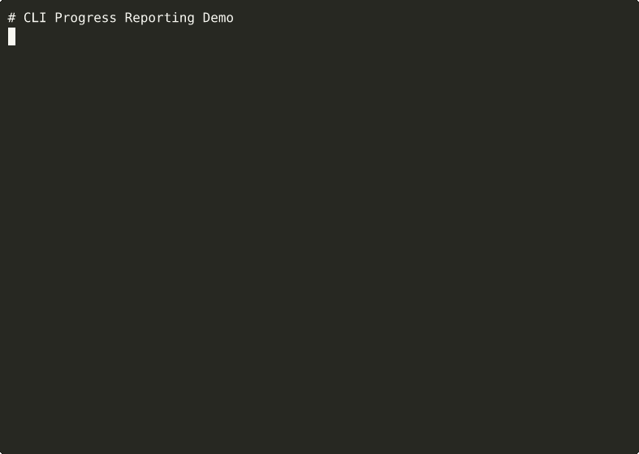

# CLI Progress Reporting

[](https://github.com/tuulbelt/tuulbelt/actions/workflows/test-all-tools.yml)
[](https://github.com/tuulbelt/tuulbelt/actions)


[](LICENSE)

Concurrent-safe progress reporting for CLI tools using file-based atomic writes.

## Problem

When building CLI tools that process multiple items, you need a way to:
- Track progress across different processes or scripts
- Report progress updates safely from concurrent tasks
- Persist progress state that survives process crashes
- Query progress from separate monitoring scripts

Existing solutions require complex state management or don't handle concurrency well.

## Features

- **Zero runtime dependencies** — Uses only Node.js built-in modules
- **Concurrent-safe** — Atomic file writes prevent corruption
- **Persistent** — Progress survives process crashes and restarts
- **Multi-tracker** — Track multiple independent progress states
- **Simple API** — Both library and CLI interfaces
- **TypeScript** — Full type safety with strict mode

## Installation

Clone the repository:

```bash
git clone https://github.com/tuulbelt/cli-progress-reporting.git
cd cli-progress-reporting
npm install  # Install dev dependencies only
```

No runtime dependencies — this tool uses only Node.js standard library.

## Usage

### As a Library

```typescript
import { init, increment, get, finish, formatProgress } from './src/index.js';

const config = { id: 'my-task' };

// Initialize progress
const initResult = init(100, 'Processing files', config);
if (initResult.ok) {
  console.log(formatProgress(initResult.value));
  // [0%] 0/100 - Processing files (0s)
}

// Increment progress
for (let i = 0; i < 100; i++) {
  increment(1, `Processing file ${i + 1}`, config);
}

// Get current state
const state = get(config);
if (state.ok) {
  console.log(state.value.percentage); // 100
}

// Mark as finished
finish('All files processed!', config);
```

### As a CLI

```bash
# Initialize progress
npx tsx src/index.ts init --total 100 --message "Processing files" --id myproject

# Increment progress
npx tsx src/index.ts increment --amount 5 --id myproject

# Set absolute progress
npx tsx src/index.ts set --current 75 --message "Almost done" --id myproject

# Get current state
npx tsx src/index.ts get --id myproject

# Mark as finished
npx tsx src/index.ts finish --message "Complete!" --id myproject

# Clear progress file
npx tsx src/index.ts clear --id myproject
```

### In Shell Scripts

```bash
#!/bin/bash

TASK_ID="my-batch-job"
TOTAL_FILES=$(ls data/*.csv | wc -l)

# Initialize
npx tsx src/index.ts init --total $TOTAL_FILES --message "Processing CSV files" --id "$TASK_ID"

# Process files
for file in data/*.csv; do
  process_file "$file"
  npx tsx src/index.ts increment --amount 1 --message "Processed $(basename $file)" --id "$TASK_ID"
done

# Finish
npx tsx src/index.ts finish --message "All files processed" --id "$TASK_ID"
```

## API

### `init(total: number, message: string, config?: ProgressConfig): Result<ProgressState>`

Initialize progress tracking.

**Parameters:**
- `total` — Total units of work (must be > 0)
- `message` — Initial progress message
- `config` — Optional configuration
  - `id` — Unique tracker ID (default: 'default')
  - `filePath` — Custom file path (default: temp directory)

**Returns:** Result with initialized state or error

**Example:**
```typescript
const result = init(100, 'Processing items', { id: 'my-task' });
```

---

### `increment(amount?: number, message?: string, config?: ProgressConfig): Result<ProgressState>`

Increment progress by a specified amount.

**Parameters:**
- `amount` — Amount to increment (default: 1, must be ≥ 0)
- `message` — Optional new message
- `config` — Configuration object

**Returns:** Result with updated state or error

**Example:**
```typescript
const result = increment(5, 'Processed 5 items');
```

---

### `set(current: number, message?: string, config?: ProgressConfig): Result<ProgressState>`

Set progress to an absolute value.

**Parameters:**
- `current` — Current progress value (must be ≥ 0)
- `message` — Optional new message
- `config` — Configuration object

**Returns:** Result with updated state or error

**Example:**
```typescript
const result = set(75, 'Almost done');
```

---

### `finish(message?: string, config?: ProgressConfig): Result<ProgressState>`

Mark progress as complete.

**Parameters:**
- `message` — Optional completion message
- `config` — Configuration object

**Returns:** Result with final state or error

**Example:**
```typescript
const result = finish('All tasks complete!');
```

---

### `get(config?: ProgressConfig): Result<ProgressState>`

Get current progress state.

**Parameters:**
- `config` — Configuration object

**Returns:** Result with current state or error

**Example:**
```typescript
const result = get({ id: 'my-task' });
if (result.ok) {
  console.log(`Progress: ${result.value.percentage}%`);
}
```

---

### `clear(config?: ProgressConfig): Result<void>`

Remove progress file.

**Parameters:**
- `config` — Configuration object

**Returns:** Result indicating success or error

**Example:**
```typescript
const result = clear({ id: 'my-task' });
```

---

### `formatProgress(state: ProgressState): string`

Format progress state as a human-readable string.

**Parameters:**
- `state` — Progress state to format

**Returns:** Formatted string like `[50%] 50/100 - Processing (5s)`

**Example:**
```typescript
const state = get();
if (state.ok) {
  console.log(formatProgress(state.value));
}
```

## Data Structure

Progress state is stored as JSON:

```typescript
interface ProgressState {
  total: number;           // Total units of work
  current: number;         // Current units completed
  message: string;         // User-friendly message
  percentage: number;      // Percentage complete (0-100)
  startTime: number;       // Timestamp when started (ms)
  updatedTime: number;     // Timestamp of last update (ms)
  complete: boolean;       // Whether progress is complete
}
```

## Concurrent Safety

The tool uses file-based atomic writes for concurrent safety:

1. **Unique filenames** — Each tracker ID gets a separate file
2. **Atomic rename** — Write to temp file, then rename atomically
3. **Random temp names** — Prevents temp file collisions
4. **File locking** — OS-level atomicity guarantees

Multiple processes can safely update the same progress tracker.

## Examples

See the `examples/` directory for runnable examples:

```bash
# Basic usage
npx tsx examples/basic.ts

# Concurrent tracking
npx tsx examples/concurrent.ts

# Shell script usage
bash examples/cli-usage.sh
```

## Testing

```bash
npm test              # Run all tests (111 tests)
npm run build         # TypeScript compilation
npx tsc --noEmit      # Type check only
```

**Test Coverage:** 111 tests
- Unit tests (35 tests)
- CLI integration tests (28 tests)
- Filesystem edge cases (21 tests)
- Fuzzy tests (32 tests)

**Test Quality:**
- 100% pass rate
- Zero flaky tests (validated with Test Flakiness Detector)
- Fully deterministic
- Comprehensive edge case coverage

### Dogfooding: Tool Composition

This tool demonstrates BIDIRECTIONAL VALIDATION - we both USE and are VALIDATED BY other Tuulbelt tools:

**1. Used By Test Flakiness Detector (Library Integration)**

The **Test Flakiness Detector** integrates cli-progress-reporting to show real-time progress during detection (when running ≥5 iterations):

```bash
cd ../test-flakiness-detector
npx tsx src/index.ts --test "npm test" --runs 20 --verbose
# [INFO] Progress tracking enabled (dogfooding cli-progress-reporting)
# [INFO] Run 1/20
# [INFO] Run 2/20 passed (2 passed, 0 failed)
# ...
```

This provides:
- Live run counts and pass/fail status
- Better UX for long detection runs (50-100 iterations)
- Real-world validation of the progress reporting tool
- Graceful fallback when cloned standalone

**2. High-Value Composition Scripts**

**Test Flakiness Detector** - Prove concurrent safety (bidirectional validation):
```bash
./scripts/dogfood-flaky.sh 20
# ✅ NO FLAKINESS DETECTED
# 125 tests × 20 runs = 2,500 executions
# Validates concurrent progress tracking
```

**Output Diffing Utility** - Prove deterministic outputs:
```bash
./scripts/dogfood-diff.sh
# Compares test outputs between runs
# Should be IDENTICAL (no random data)
```

This creates a **bidirectional validation network** where:
- ↔️ Test Flakiness Detector USES CLI Progress (library integration)
- ↔️ Test Flakiness Detector VALIDATES CLI Progress (composition scripts)

See `DOGFOODING_STRATEGY.md` for implementation details.

## Error Handling

All operations return a `Result<T>` type:

```typescript
type Result<T> =
  | { ok: true; value: T }
  | { ok: false; error: string };
```

Errors are never thrown, making it safe to use in scripts.

**Common errors:**
- `Total must be greater than 0` — Invalid initialization
- `Increment amount must be non-negative` — Negative increment
- `Progress file does not exist` — Tracker not initialized
- `Failed to write progress: ...` — File system error

## CLI Exit Codes

- `0` — Success
- `1` — Error (invalid arguments, file operation failed, etc.)

## Performance

- **File I/O:** ~1-2ms per operation (read + write)
- **Atomic writes:** No performance penalty vs. direct writes
- **Scalability:** Tested with 1,000,000 total units

## Limitations

- **File-based:** Not suitable for in-memory progress bars
- **Polling required:** No push notifications when progress changes
- **Temp directory:** Progress files stored in OS temp directory by default

## Architecture

Uses the **write-then-rename** pattern for atomic updates:

1. Write new state to temporary file (`progress-{id}.json.tmp.{random}`)
2. Atomically rename temp file to target file (`progress-{id}.json`)
3. Read operations always see complete, valid JSON

This ensures concurrent processes never read partial writes.

## Future Enhancements

Potential improvements for future versions:

- Real-time progress streaming via WebSocket or Server-Sent Events
- Built-in progress bar rendering with customizable formats
- Progress aggregation across multiple trackers
- Time estimation based on historical progress rates
- Integration with popular build tools (npm scripts, Make, Gradle)
- Optional compression for progress state files


## Demo



**[▶ View interactive recording on asciinema.org](https://asciinema.org/a/vlJ2HraozoovzzRyqF5EVkRgH)**

> Try it online: [](https://stackblitz.com/github/tuulbelt/tuulbelt/tree/main/cli-progress-reporting)

## License

MIT — see [LICENSE](LICENSE)

## Contributing

See [CONTRIBUTING.md](../CONTRIBUTING.md) for contribution guidelines.

## Related Tools

Part of the [Tuulbelt](https://github.com/tuulbelt/tuulbelt) collection:
- [Test Flakiness Detector](../test-flakiness-detector/) — Detect unreliable tests
- More tools coming soon...
