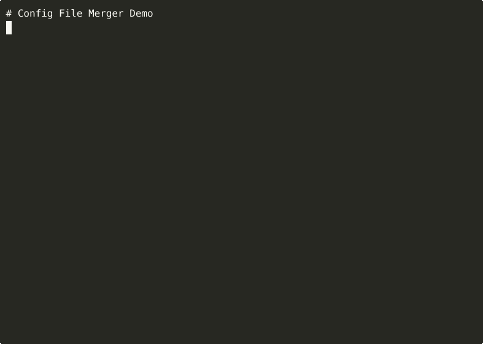

# Config File Merger / `cfgmerge`

[](https://github.com/tuulbelt/tuulbelt/actions/workflows/test-all-tools.yml)


[](LICENSE)

Merge configuration from ENV variables, config files, and CLI arguments with clear precedence rules and source tracking.

## Problem

Applications often need configuration from multiple sources:
- Environment variables (`DATABASE_URL=...`)
- Config files (JSON)
- CLI arguments (`--port 3000`)

Existing solutions require heavy dependencies (dotenv, convict, cosmiconfig), don't handle all sources, or have unclear precedence rules.

**cfgmerge** solves this with zero dependencies and explicit precedence.

## Features

- **Zero runtime dependencies** — standard library only
- **Clear precedence** — CLI > ENV > File > Defaults
- **Source tracking** — know where each value came from
- **Type coercion** — automatic parsing of numbers, booleans, null
- **Prefix filtering** — filter ENV vars by prefix (e.g., `APP_`)
- **Composable** — use as CLI or library

## Installation

```bash
git clone https://github.com/tuulbelt/tuulbelt.git
cd tuulbelt/config-file-merger
npm install
```

**CLI names** — both short and long forms work:
- Short (recommended): `cfgmerge`
- Long: `config-file-merger`

**Recommended setup:**

```bash
npm link  # Enable the 'cfgmerge' command globally
cfgmerge --help
```

## Usage

### As a CLI

```bash
# Merge env vars with APP_ prefix and a config file
cfgmerge --env --prefix APP_ --file config.json

# Override with CLI args
cfgmerge --file config.json --args "port=3000,debug=true"

# Track where each value came from
cfgmerge --file config.json --args "port=3000" --track-sources

# Use defaults with env overrides
cfgmerge --defaults defaults.json --env --prefix MY_APP_
```

**Output (without `--track-sources`):**
```json
{
  "port": 3000,
  "debug": true,
  "host": "localhost"
}
```

**Output (with `--track-sources`):**
```json
{
  "port": { "value": 3000, "source": "cli" },
  "debug": { "value": true, "source": "cli" },
  "host": { "value": "localhost", "source": "file" }
}
```

### As a Library

```typescript
import { mergeConfig, getValue, parseJsonFile } from './src/index.js';

// Load config file
const fileResult = parseJsonFile('config.json');
if (!fileResult.ok) {
  console.error(fileResult.error);
  process.exit(1);
}

// Merge from multiple sources
const result = mergeConfig({
  defaults: { port: 8080, host: 'localhost' },
  file: fileResult.data,
  env: process.env,
  envPrefix: 'APP_',
  cli: { debug: true },
  trackSources: false,
});

if (result.ok) {
  const port = getValue<number>(result.config, 'port', 8080);
  console.log(`Starting on port ${port}`);
}
```

## Precedence

Values are merged in this order (highest precedence first):

1. **CLI arguments** (`--args`) — explicit overrides
2. **Environment variables** (`--env`) — deployment config
3. **Config file** (`--file`) — application defaults
4. **Default values** (`--defaults`) — fallback values

## CLI Options

| Option | Short | Description |
|--------|-------|-------------|
| `--env` | `-e` | Include environment variables |
| `--prefix PREFIX` | `-p` | Filter env vars by prefix (e.g., `APP_`) |
| `--no-strip-prefix` | | Keep prefix in output keys |
| `--no-lowercase` | | Keep original env var case |
| `--file FILE` | `-f` | Load config from JSON file |
| `--defaults FILE` | `-d` | Load default values from JSON file |
| `--args ARGS` | `-a` | CLI arguments as `key=value,key2=value2` |
| `--track-sources` | `-t` | Show source of each value in output |
| `--help` | `-h` | Show help message |
| `--version` | `-V` | Show version |

## API

### `mergeConfig(options: MergeOptions): Result`

Merge configuration from multiple sources.

```typescript
interface MergeOptions {
  env?: Record<string, string | undefined>;  // Environment variables
  envPrefix?: string;                         // Filter by prefix
  stripPrefix?: boolean;                      // Remove prefix from keys (default: true)
  lowercaseEnv?: boolean;                     // Lowercase env keys (default: true)
  file?: Record<string, unknown>;             // Config file contents
  cli?: Record<string, unknown>;              // CLI arguments
  defaults?: Record<string, unknown>;         // Default values
  trackSources?: boolean;                     // Include source in output
}
```

### `parseJsonFile(filePath: string): ParseResult`

Parse a JSON config file.

```typescript
const result = parseJsonFile('config.json');
if (result.ok) {
  console.log(result.data);  // { port: 3000, ... }
} else {
  console.error(result.error);
}
```

### `parseCliArgs(args: string): Record<string, ConfigValue>`

Parse CLI arguments in `key=value,key2=value2` format.

```typescript
const parsed = parseCliArgs('port=3000,debug=true');
// { port: { value: 3000, source: 'cli' }, debug: { value: true, source: 'cli' } }
```

### `parseEnv(env, prefix?, stripPrefix?, lowercase?): Record<string, ConfigValue>`

Parse environment variables with optional filtering.

```typescript
const parsed = parseEnv(process.env, 'APP_');
// { port: { value: '3000', source: 'env' }, host: { value: 'localhost', source: 'env' } }
```

### `getValue<T>(config, key, defaultValue?): T | undefined`

Get a typed value from merged config.

```typescript
const port = getValue<number>(config, 'port', 8080);
const debug = getValue<boolean>(config, 'debug', false);
```

## Type Coercion

CLI arguments are automatically parsed:

| Input | Output | Type |
|-------|--------|------|
| `"true"` | `true` | boolean |
| `"false"` | `false` | boolean |
| `"null"` | `null` | null |
| `"42"` | `42` | number |
| `"3.14"` | `3.14` | number |
| `"hello"` | `"hello"` | string |
| `'"42"'` | `"42"` | string (quoted) |

## Testing

```bash
npm test              # Run all tests
npm test -- --watch   # Watch mode
```

## Examples

See `examples/` directory:

```bash
npx tsx examples/basic.ts
npx tsx examples/advanced.ts
```

## Demo



**[▶ View interactive recording on asciinema.org](https://asciinema.org/a/placeholder-config-file-merger)**

> Try it online: [](https://stackblitz.com/github/tuulbelt/tuulbelt/tree/main/config-file-merger)

## Dogfooding

Config File Merger uses other Tuulbelt tools to validate its reliability:

### Test Flakiness Detection

```bash
./scripts/dogfood-flaky.sh [runs]
# Validates all 135 tests are deterministic
# Default: 10 runs = 1,350 test executions
```

### Output Determinism

```bash
./scripts/dogfood-diff.sh
# Proves config merging produces identical output for identical input
```

See [DOGFOODING_STRATEGY.md](DOGFOODING_STRATEGY.md) for composition details.

## Error Handling

Exit codes:
- `0` — Success
- `1` — Error (file not found, invalid JSON)

Errors are returned via Result pattern, not thrown:

```typescript
const result = parseJsonFile('missing.json');
if (!result.ok) {
  console.error(result.error);  // "File not found: missing.json"
}
```

## Specification

See [SPEC.md](SPEC.md) for detailed technical specification including:
- Precedence rules and merge behavior
- Type coercion rules
- Environment variable handling
- Error cases and exit codes

## License

MIT — see [LICENSE](LICENSE)

## Related Tools

Part of the [Tuulbelt](https://github.com/tuulbelt/tuulbelt) collection:
- [Test Flakiness Detector](../test-flakiness-detector/) — Detect unreliable tests
- [CLI Progress Reporting](../cli-progress-reporting/) — Concurrent-safe progress updates
- [Structured Error Handler](../structured-error-handler/) — Error context preservation
