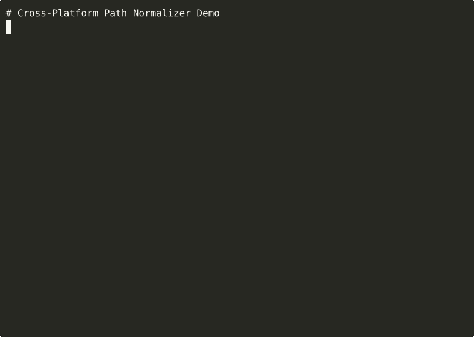

# Cross-Platform Path Normalizer / `normpath`

[](https://github.com/tuulbelt/tuulbelt/actions/workflows/test-all-tools.yml)
[](https://github.com/tuulbelt/tuulbelt/actions)


[](LICENSE)

Convert Windows/Unix paths to consistent format with zero dependencies.

## Problem

When building cross-platform tools, you need to:
- Handle both Windows (`C:\Users\file.txt`) and Unix (`/home/user/file.txt`) paths
- Convert paths between formats for testing or deployment
- Normalize paths with inconsistent separators (`C:/Users\Documents/file.txt`)
- Detect whether a path is Windows or Unix format

Existing solutions require heavy dependencies or don't handle edge cases like UNC paths, drive letters, and mixed separators.

## Features

- **Zero runtime dependencies** — Uses only Node.js built-in `path` module
- **Format detection** — Automatically detect Windows vs Unix paths
- **Bidirectional conversion** — Convert to Unix (`/c/Users`) or Windows (`C:\Users`)
- **UNC path support** — Handles network paths (`\\server\share` ↔ `//server/share`)
- **Edge case handling** — Mixed slashes, redundant separators, special characters
- **TypeScript** — Full type safety with strict mode

## Installation

Clone the repository:

```bash
git clone https://github.com/tuulbelt/cross-platform-path-normalizer.git
cd cross-platform-path-normalizer
npm install  # Install dev dependencies only
```

**CLI names** - both short and long forms work:
- Short (recommended): `normpath`
- Long: `cross-platform-path-normalizer`

**Recommended setup** - install globally for easy access:
```bash
npm link  # Enable the 'normpath' command globally
normpath --help
```

No runtime dependencies — this tool uses only Node.js standard library.

## Usage

### As a Library

```typescript
import { normalizePath, normalizeToUnix, normalizeToWindows, detectPathFormat } from './src/index.js';

// Auto-detect and normalize
const result = normalizePath('C:\\Users\\file.txt');
console.log(result.path);    // 'C:\Users\file.txt'
console.log(result.format);  // 'windows'

// Force conversion to Unix format
const unixResult = normalizePath('C:\\Users\\file.txt', { format: 'unix' });
console.log(unixResult.path); // '/c/Users/file.txt'

// Force conversion to Windows format
const winResult = normalizePath('/home/user/file.txt', { format: 'windows' });
console.log(winResult.path); // 'home\user\file.txt'

// Direct conversion functions
normalizeToUnix('C:\\Program Files\\app');    // '/c/Program Files/app'
normalizeToWindows('/c/Users/Documents');     // 'C:\Users\Documents'

// Detect path format
detectPathFormat('C:\\Users\\file.txt');  // 'windows'
detectPathFormat('/home/user/file.txt');  // 'unix'
```

### As a CLI

```bash
# Auto-detect and normalize
normpath "C:\\Users\\file.txt"

# Force Unix format
normpath --format unix "C:\\Users\\file.txt"
# Output: { "success": true, "path": "/c/Users/file.txt", "format": "unix" }

# Force Windows format
normpath --format windows "/home/user/file.txt"
# Output: { "success": true, "path": "home\\user\\file.txt", "format": "windows" }

# Resolve to absolute path
normpath --absolute "./relative/path.txt"

# Enable verbose output
normpath --verbose "C:\\Users\\file.txt"
```

### In Shell Scripts

```bash
#!/bin/bash

# Convert Windows paths to Unix for processing
WIN_PATH="C:\\Users\\Documents\\data.csv"
UNIX_PATH=$(normpath --format unix "$WIN_PATH" | jq -r '.path')

echo "Processing $UNIX_PATH"
process_file "$UNIX_PATH"

# Convert back to Windows for output
RESULT=$(normpath --format windows "$UNIX_PATH")
echo "$RESULT"
```

## API

### `normalizePath(path: string, options?: NormalizeOptions): NormalizeResult`

Normalize a path to the specified format.

**Parameters:**
- `path` — Path to normalize (required)
- `options` — Optional configuration
  - `format` — Target format: `'unix'`, `'windows'`, or `'auto'` (default: `'auto'`)
  - `absolute` — Resolve to absolute path (default: `false`)
  - `verbose` — Enable verbose output (default: `false`)

**Returns:** Result object with:
- `success` — Whether normalization succeeded
- `path` — Normalized path (empty string on error)
- `format` — Detected or specified format
- `error` — Error message (only present on failure)

**Example:**
```typescript
const result = normalizePath('C:\\Users\\file.txt', { format: 'unix' });
// { success: true, path: '/c/Users/file.txt', format: 'unix' }
```

---

### `normalizeToUnix(path: string): string`

Convert any path to Unix format with forward slashes.

**Parameters:**
- `path` — Path to convert

**Returns:** Path in Unix format

**Conversions:**
- `C:\Users\file.txt` → `/c/Users/file.txt`
- `\\server\share\file.txt` → `//server/share/file.txt`
- `/home/user/file.txt` → `/home/user/file.txt` (no-op)

**Example:**
```typescript
normalizeToUnix('C:\\Program Files\\app'); // '/c/Program Files/app'
```

---

### `normalizeToWindows(path: string): string`

Convert any path to Windows format with backslashes.

**Parameters:**
- `path` — Path to convert

**Returns:** Path in Windows format

**Conversions:**
- `/c/Users/file.txt` → `C:\Users\file.txt`
- `//server/share/file.txt` → `\\server\share\file.txt`
- `C:\Users\file.txt` → `C:\Users\file.txt` (no-op)

**Example:**
```typescript
normalizeToWindows('/c/Users/Documents'); // 'C:\Users\Documents'
```

---

### `detectPathFormat(path: string): 'windows' | 'unix'`

Detect whether a path is Windows or Unix format.

**Parameters:**
- `path` — Path to analyze

**Returns:** `'windows'` or `'unix'`

**Detection Rules:**
- Windows: Contains backslashes, drive letters (`C:`), or UNC paths (`\\server`)
- Unix: Everything else

**Example:**
```typescript
detectPathFormat('C:\\Users\\file.txt');     // 'windows'
detectPathFormat('/home/user/file.txt');     // 'unix'
detectPathFormat('folder\\subfolder');       // 'windows'
detectPathFormat('./relative/path');         // 'unix'
```

## Types

### `NormalizeOptions`

```typescript
interface NormalizeOptions {
  format?: 'unix' | 'windows' | 'auto';
  absolute?: boolean;
  verbose?: boolean;
}
```

### `NormalizeResult`

```typescript
interface NormalizeResult {
  success: boolean;
  path: string;
  format: 'unix' | 'windows';
  error?: string;
}
```

### `PathFormat`

```typescript
type PathFormat = 'unix' | 'windows' | 'auto';
```

## Error Handling

All errors are returned in the result object, never thrown:

```typescript
type Result =
  | { success: true; path: string; format: 'unix' | 'windows' }
  | { success: false; path: ''; format: 'unix' | 'windows'; error: string };
```

**Common errors:**
- `Path must be a string` — Invalid input type
- `Path cannot be empty` — Empty or whitespace-only input

## CLI Exit Codes

- `0` — Success
- `1` — Error (invalid arguments, empty path, etc.)

## Performance

- **Conversion:** < 1ms per path (pure string manipulation)
- **No I/O:** All operations in-memory
- **Scalability:** Tested with paths up to 1000+ characters

## Limitations

- **Absolute path conversion:** Unix paths without drive letters (e.g., `/home/user`) become relative on Windows (e.g., `home\user`)
- **No validation:** Does not check if paths exist on filesystem
- **Format-specific features:** Some path features don't translate (e.g., Unix symlinks, Windows long path prefix `\\?\`)

## Architecture

**Conversion Strategy:**
1. Detect UNC paths and drive letters before transformation
2. Apply format-specific transformations (slash direction, drive letter casing)
3. Deduplicate redundant separators while preserving UNC double-slash
4. Return normalized path in target format

**No external dependencies** — Uses only Node.js `path` module for helper functions.

## Security

- **String transformation only**: This tool transforms path strings but does not access the filesystem
- **Path validation required**: Always validate normalized paths before file operations (e.g., check they're within expected directories)
- **No path traversal prevention**: Use additional security checks if processing untrusted paths

```typescript
import { normalizePath } from '@tuulbelt/cross-platform-path-normalizer';

const normalized = normalizePath(userInput, 'unix');

// Always validate before file operations
if (!normalized.startsWith('/allowed/directory/')) {
  throw new Error('Path outside allowed directory');
}
```

## Testing

```bash
npm test                # Run all tests (128 tests)
npm run test:unit       # Unit tests only
npm run test:integration # Integration tests
npm run test:stress     # Stress tests (large inputs)
npm run test:fuzzy      # Property-based fuzzy tests
npm run test:dogfood    # Validate test suite reliability
```

The test suite includes:
- **51 unit tests** — Core path normalization logic
- **33 integration tests** — CLI behavior and file I/O
- **21 stress tests** — Large inputs (1000+ character paths)
- **Fuzzy tests** — Property-based testing with random inputs

### Dogfooding: Tool Composition

This tool demonstrates composability by being VALIDATED BY other Tuulbelt tools:

**Test Flakiness Detector** - Validate test reliability:
```bash
./scripts/dogfood-flaky.sh 10
# OR: npm run test:dogfood
# ✅ NO FLAKINESS DETECTED
# 145 tests × 10 runs = 1,450 executions
```

This proves:
- All 145 tests are deterministic
- No race conditions in async code
- No probabilistic test logic
- No shared state between tests

**Output Diffing Utility** - Prove identical outputs:
```bash
./scripts/dogfood-diff.sh
# Compares test outputs between runs
# Should be IDENTICAL (no random data)
```

**Used By Other Tools:**
- Output Diffing Utility (path input handling)
- File-Based Semaphore (lock file paths)
- Test Flakiness Detector (test command paths)

This demonstrates how Tuulbelt tools validate each other — the test-flakiness-detector ensures our test suite is reliable and production-ready.

See `DOGFOODING_STRATEGY.md` for implementation details.

## Edge Cases Handled

- **Mixed separators:** `C:/Users\Documents/file.txt` → Normalized
- **Redundant slashes:** `C:\\\Users\\\file.txt` → `C:\Users\file.txt`
- **UNC paths:** `\\server\share` ↔ `//server/share`
- **Drive letter casing:** `c:\users` → `/c/users` (lowercase) or `C:\users` (uppercase)
- **Spaces and special characters:** Preserved in path components
- **Relative paths:** `../../parent` → Slash direction changed
- **Root paths:** `/` and `C:\` handled correctly

## Future Enhancements

Potential improvements for future versions:

- Path validation (check if path exists)
- Symlink resolution
- Windows long path support (`\\?\` prefix)
- Path comparison (case-insensitive on Windows)
- Relative path calculation between two paths


## Demo



**[▶ View interactive recording on asciinema.org](https://asciinema.org/a/WzR3SV3mPpHQQ28f6d9Xsu79b)**

> Try it online: [](https://stackblitz.com/github/tuulbelt/tuulbelt/tree/main/cross-platform-path-normalizer)

## License

MIT — see [LICENSE](LICENSE)

## Contributing

See [CONTRIBUTING.md](../CONTRIBUTING.md) for contribution guidelines.

## Related Tools

Part of the [Tuulbelt](https://github.com/tuulbelt/tuulbelt) collection:
- [Test Flakiness Detector](../test-flakiness-detector/) — Detect unreliable tests
- [CLI Progress Reporting](../cli-progress-reporting/) — Concurrent-safe progress updates
- More tools coming soon...
