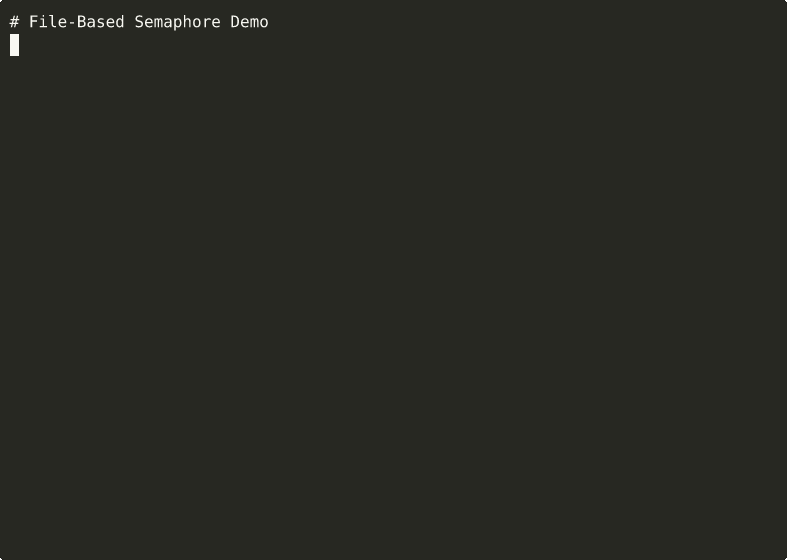

# File-Based Semaphore

[](https://github.com/tuulbelt/tuulbelt/actions/workflows/test-all-tools.yml)


[](LICENSE)

Cross-platform file-based semaphore for process coordination.

## Problem

When multiple processes need to coordinate access to a shared resource, you need a locking mechanism that:
- Works across different programming languages
- Survives process crashes (with stale lock detection)
- Doesn't require a running daemon or server
- Uses only standard filesystem operations

File-based semaphores provide exactly this: a portable, reliable locking primitive using lock files.

## Features

- **Zero runtime dependencies** (uses only Rust standard library)
- **Cross-platform support** (Linux, macOS, Windows)
- **Both library and CLI interfaces**
- **Stale lock detection** with configurable timeout
- **RAII-style guards** for automatic release
- **Atomic operations** using exclusive file creation

## Installation

### From Source

```bash
git clone https://github.com/tuulbelt/file-based-semaphore.git
cd file-based-semaphore
cargo build --release
```

The binary supports **both short and long command names**:
- Short (recommended): `target/release/sema`
- Long: `target/release/file-semaphore`

**Recommended setup** - install globally for easy access:
```bash
cargo install --path .
# Now use `sema` anywhere
sema --help
```

### As a Library

Add to your `Cargo.toml`:

```toml
[dependencies]
file-based-semaphore = { git = "https://github.com/tuulbelt/file-based-semaphore.git" }
```

## Usage

### CLI

```bash
# Try to acquire a lock (non-blocking)
sema try /tmp/my.lock

# Acquire with timeout (blocks up to 10 seconds)
sema acquire /tmp/my.lock --timeout 10

# Check lock status
sema status /tmp/my.lock

# Release a lock
sema release /tmp/my.lock

# Wait for a lock to be released
sema wait /tmp/my.lock --timeout 30

# Get JSON output
sema status /tmp/my.lock --json
```

### Library

```rust
use file_based_semaphore::{Semaphore, SemaphoreConfig};
use std::time::Duration;

fn main() -> Result<(), Box<dyn std::error::Error>> {
    let config = SemaphoreConfig {
        stale_timeout: Some(Duration::from_secs(60)),
        acquire_timeout: Some(Duration::from_secs(5)),
        ..Default::default()
    };

    let semaphore = Semaphore::new("/tmp/my-lock.lock", config)?;

    // RAII-style: lock auto-released when guard drops
    {
        let _guard = semaphore.try_acquire()?;
        // Critical section - only one process can be here
        do_work();
    } // Guard dropped, lock released

    Ok(())
}
```

## API

### `Semaphore::new(path, config) -> Result<Semaphore, SemaphoreError>`

Create a new semaphore with the given lock file path.

### `semaphore.try_acquire() -> Result<SemaphoreGuard, SemaphoreError>`

Try to acquire the lock without blocking. Returns immediately.

### `semaphore.acquire() -> Result<SemaphoreGuard, SemaphoreError>`

Acquire the lock, blocking until available or timeout.

### `semaphore.is_locked() -> bool`

Check if the lock is currently held.

### `semaphore.lock_info() -> Option<LockInfo>`

Get information about the current lock holder.

### `semaphore.force_release() -> Result<(), SemaphoreError>`

Force release a lock (even if held by another process).

### `SemaphoreConfig`

```rust
SemaphoreConfig {
    stale_timeout: Some(Duration::from_secs(3600)),  // Detect stale locks
    acquire_timeout: Some(Duration::from_secs(30)), // Max wait time
    retry_interval: Duration::from_millis(100),     // Polling interval
}
```

## Lock File Format

Lock files contain simple key-value pairs:

```
pid=12345
timestamp=1703520000
tag=optional-description
```

This format is:
- Human-readable for debugging
- Easy to parse from any language
- Forward-compatible (unknown keys are ignored)

## Exit Codes

| Code | Meaning |
|------|---------|
| 0 | Success (lock acquired/released, or lock is free) |
| 1 | Lock already held or timeout |
| 2 | Invalid arguments |
| 3 | IO or system error |

## Examples

### Bash Script Coordination

```bash
#!/bin/bash

# Acquire lock before running exclusive task
if sema try /tmp/deploy.lock --tag "deploy-$(date +%s)"; then
    echo "Lock acquired, deploying..."
    ./deploy.sh
    sema release /tmp/deploy.lock
else
    echo "Another deployment in progress"
    exit 1
fi
```

### Concurrent Process Guard

```rust
use file_based_semaphore::{Semaphore, SemaphoreConfig};
use std::time::Duration;

// Multiple worker processes competing for exclusive access
let sem = Semaphore::new("/tmp/worker.lock", SemaphoreConfig {
    stale_timeout: Some(Duration::from_secs(300)), // 5 min stale timeout
    acquire_timeout: Some(Duration::from_secs(60)), // Wait up to 1 min
    ..Default::default()
})?;

match sem.acquire() {
    Ok(guard) => {
        process_exclusive_work();
        // Guard dropped here, lock released
    }
    Err(e) => eprintln!("Could not acquire lock: {}", e),
}
```

## Testing

```bash
cargo test              # Run all tests
cargo test -- --nocapture  # Show output
```

### Dogfooding

This tool demonstrates composability by being VALIDATED BY other Tuulbelt tools:

**Test Flakiness Detector** - Validate concurrent safety:
```bash
./scripts/dogfood-flaky.sh 10
# ✅ NO FLAKINESS DETECTED
# 85 tests × 10 runs = 850 executions
```

**Output Diffing Utility** - Prove deterministic outputs:
```bash
./scripts/dogfood-diff.sh
# Test outputs should be identical
```

This demonstrates cross-language composition - Rust tools validated by TypeScript tools via CLI interfaces.

**Used By:** Output Diffing Utility (cache locking demo)

See `DOGFOODING_STRATEGY.md` for implementation details.

## Design Decisions

### Why file-based locking?

1. **Portable**: Works everywhere with a filesystem
2. **No daemon**: Doesn't require a running service
3. **Crash-safe**: Stale detection handles crashed processes
4. **Language-agnostic**: Any language can read/write lock files

### Why not flock/lockf?

- Platform-specific behavior (especially on NFS)
- Doesn't survive process crashes reliably
- This approach is simpler and more portable

### Why O_EXCL instead of advisory locks?

- `O_CREAT | O_EXCL` is atomic on POSIX and Windows
- Works on network filesystems
- Clear semantics: file exists = lock held

## Limitations

- **Network filesystems**: Works but with caveats on NFS (use NFSv4+ with proper locking)
- **Race window**: Small window between stale detection and acquisition
- **Clock skew**: Stale detection relies on system time; ensure synchronized clocks

## Related Tools

- [Test Flakiness Detector](../test-flakiness-detector/) - Validates this tool's test suite reliability
- [CLI Progress Reporting](../cli-progress-reporting/) - Could use this tool for exclusive log access


## Demo



**[▶ View interactive recording on asciinema.org](https://asciinema.org/a/OBoVdKe9xLXnOW1jLsGfoqV2Q)**

> Try it online: [](https://stackblitz.com/github/tuulbelt/tuulbelt/tree/main/file-based-semaphore)

## License

MIT - see [LICENSE](LICENSE)
