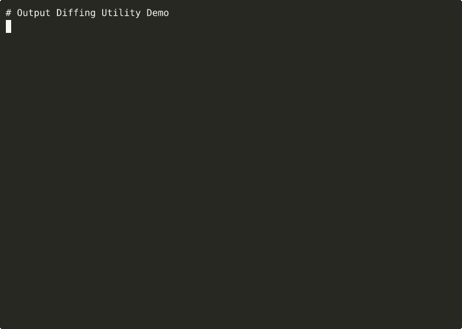

# Output Diffing Utility

Semantic diff tool for JSON, text, and binary files with zero dependencies.

## Problem

When comparing files in tests, builds, or data pipelines, you need to see **what changed** in a structured, semantic way. Standard `diff` works for text but doesn't understand JSON structure or binary formats. This tool provides:
- **Text diffs** with LCS algorithm (line-by-line comparison)
- **JSON diffs** with structural understanding (field paths, not lines)
- **Binary diffs** with byte-level comparison (hex output)

All with zero external dependencies.

## Features

- **Zero runtime dependencies** (uses only Rust standard library)
- **Multiple diff types**: Text (LCS), JSON (structural), Binary (byte-by-byte)
- **Multiple output formats**: Unified, JSON, side-by-side, compact
- **Cross-platform support** (Linux, macOS, Windows)
- **Both library and CLI interfaces**
- **Proper exit codes** (0=identical, 1=differ, 2=error)
- **Composable** with other Tuulbelt tools

## Installation

### From Source

```bash
git clone https://github.com/tuulbelt/output-diffing-utility.git
cd output-diffing-utility
cargo build --release
```

The binary will be at `target/release/output-diff`.

### As a Library

Add to your `Cargo.toml`:

```toml
[dependencies]
output-diffing-utility = { git = "https://github.com/tuulbelt/output-diffing-utility.git" }
```

## Usage

### As a CLI

```bash
# Basic text diff
output-diff file1.txt file2.txt

# JSON structural diff
output-diff data1.json data2.json

# Binary diff
output-diff image1.png image2.png

# With ANSI color codes (works for text, JSON, and binary diffs)
output-diff --color always file1.txt file2.txt
output-diff --color always data1.json data2.json
output-diff --color always image1.png image2.png
# Or use 'auto' to enable color only when outputting to a terminal
output-diff --color auto file1.txt file2.txt

# Verbose output
output-diff --verbose file1.txt file2.txt
```

**Color Support:**
- ✅ **Text diffs**: Green for additions, red for deletions
- ✅ **JSON diffs**: Cyan for paths, green for added values, red for removed values, yellow for modifications
- ✅ **Binary diffs**: Cyan for offsets, red for old bytes, green for new bytes
- ❌ **JSON/SideBySide/Compact formats**: Color not applied (use `--format unified` for color)

**Output:**
```diff
--- file1.txt
+++ file2.txt
  line 1
- line 2
+ line 2 modified
  line 3
+ line 4
```

**Exit codes:**
- `0` - Files are identical
- `1` - Files differ
- `2` - Error occurred

### As a Library

```rust
use output_diffing_utility::{diff_text, DiffConfig};

let old = "line 1\nline 2";
let new = "line 1\nline 2 modified";

let config = DiffConfig::default();
let result = diff_text(old, new, &config);

if result.has_changes() {
    println!("Files differ!");
    println!("Additions: {}", result.additions());
    println!("Deletions: {}", result.deletions());
}
```

## API

### `diff_text(old: &str, new: &str, config: &DiffConfig) -> DiffResult`

Compare two text strings line-by-line using the LCS algorithm.

**Returns:** `DiffResult` with line-by-line changes.

### `diff_json(old: &str, new: &str, config: &DiffConfig) -> Result<JsonDiffResult, JsonError>`

Compare two JSON strings structurally (field paths, not lines).

**Returns:** `Result<JsonDiffResult, JsonError>` with structural changes.

### `diff_binary(data1: &[u8], data2: &[u8], config: &DiffConfig) -> BinaryDiffResult`

Compare two byte arrays byte-by-byte.

**Returns:** `BinaryDiffResult` with byte-level comparison.

### `DiffConfig`

```rust
DiffConfig {
    context_lines: 3,              // Lines of context around changes
    format: OutputFormat::Unified, // Unified, JSON, SideBySide, Compact
    color: false,                  // Enable ANSI color codes
    verbose: false,                // Show detailed information
}
```

### `DiffResult`, `JsonDiffResult`, `BinaryDiffResult`

Each result type provides:
- `has_changes()` / `is_identical()` - Quick check
- `additions()`, `deletions()` - Change counts
- Iterator over changes for detailed analysis

## Algorithm: Longest Common Subsequence (LCS)

The text diff uses dynamic programming to find the optimal diff:
- **Time complexity:** O(m×n) where m, n are line counts
- **Space complexity:** O(m×n)
- **Output:** Minimal set of changes (additions/deletions)

See `DIFF_ALGORITHMS_RESEARCH.md` for detailed algorithm analysis.

## Composability with Tuulbelt Tools

This tool demonstrates the power of composability by working seamlessly with other Tuulbelt tools. When in the monorepo, you can chain tools together via CLI interfaces:

### Individual Tool Compositions

**CLI Progress Reporting** - Track progress for large file diffs:
```bash
./scripts/dogfood-progress.sh
# Shows: TypeScript (progress) ↔ Rust (diff) composition
```

**Cross-Platform Path Normalizer** - Handle Windows/Unix/mixed path formats:
```bash
./scripts/dogfood-paths.sh
# Shows: Path normalization → Rust diff pipeline
```

**File-Based Semaphore** - Protect concurrent diff cache access:
```bash
./scripts/dogfood-semaphore.sh
# Shows: Rust (semaphore) → Rust (diff) composition
```

**Test Flakiness Detector** - Validate test reliability:
```bash
./scripts/dogfood-flaky.sh
# Validates all 99 tests are deterministic
```

### Complete Multi-Tool Pipeline

Run all 5 Phase 1 tools together in a single workflow:

```bash
./scripts/dogfood-pipeline.sh
```

This pipeline demonstrates:
- Cross-language composition (TypeScript ↔ Rust)
- Tools communicating via CLI interfaces only
- No runtime dependencies between tools
- Real-world use case (API version comparison)
- Graceful degradation if tools missing

See `DOGFOODING_STRATEGY.md` for implementation details.

## Development

```bash
# Run tests
cargo test

# Run with zero warnings
cargo clippy -- -D warnings

# Format code
cargo fmt

# Build optimized release
cargo build --release
```

### Dogfooding

We dogfood this tool by composing it with other Tuulbelt tools:

```bash
# Validate test reliability (Test Flakiness Detector)
./scripts/dogfood-flaky.sh 20

# Show progress tracking (CLI Progress Reporting)
./scripts/dogfood-progress.sh

# Handle cross-platform paths (Path Normalizer)
./scripts/dogfood-paths.sh

# Protect concurrent access (File-Based Semaphore)
./scripts/dogfood-semaphore.sh

# Run complete multi-tool pipeline (all 5 tools)
./scripts/dogfood-pipeline.sh
```

These scripts demonstrate real-world tool composition and validate that all 99 tests are deterministic.

## Examples

See `examples/` directory for real-world usage patterns.


## Demo



**[▶ View interactive recording on asciinema.org](#)**

> Try it online: [](https://stackblitz.com/github/tuulbelt/tuulbelt/tree/main/output-diffing-utility)

## License

MIT

## Part of Tuulbelt

This is tool #5 of 33 in the [Tuulbelt](https://github.com/tuulbelt/tuulbelt) collection of focused, zero-dependency utilities.
