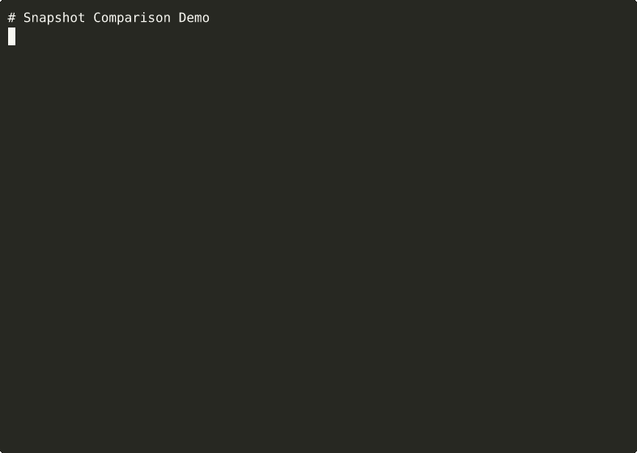

# Snapshot Comparison / `snapcmp`

Snapshot testing utility for regression detection with integrated diff output.

## Problem

Snapshot testing catches regressions by comparing current output against stored "golden" snapshots. Unlike Jest snapshots or insta, this tool:

- **Zero dependencies** - Pure Rust, no runtime dependencies
- **Integrated diffs** - Uses output-diffing-utility for rich, semantic diffs
- **Format-aware** - Understands text, JSON, and binary data
- **CLI-first** - Works with any language via stdin/stdout

## Features

- Zero runtime dependencies (uses output-diffing-utility as path dependency)
- Cross-platform support (Linux, macOS, Windows)
- Both library and CLI interfaces
- Semantic diffing for text, JSON, and binary
- Update mode for development workflows
- Orphan cleanup for snapshot management

## Installation

### From Source

```bash
git clone https://github.com/tuulbelt/snapshot-comparison.git
cd snapshot-comparison
cargo build --release
```

The binary supports **both short and long command names**:
- Short (recommended): `target/release/snapcmp`
- Long: `target/release/snapshot-comparison`

**Recommended setup** — install globally for easy access:

```bash
cargo install --path .
# Now use `snapcmp` anywhere
snapcmp --help
```

### As a Library

Add to your `Cargo.toml`:

```toml
[dependencies]
snapshot-comparison = { git = "https://github.com/tuulbelt/snapshot-comparison.git" }
```

## Usage

### As a CLI

Using short name (recommended after `cargo install --path .`):

```bash
# Create a snapshot from command output
my-program --generate | snapcmp create my-test

# Check current output against snapshot
my-program --generate | snapcmp check my-test

# Update snapshot with new expected output
my-program --generate | snapcmp update my-test

# List all snapshots
snapcmp list

# Delete a snapshot
snapcmp delete old-test

# Clean orphaned snapshots
snapcmp clean --keep test-1,test-2
```

### CLI Options

```
Options:
  -d, --dir <PATH>  Snapshot directory (default: ./snapshots)
  -t, --type <TYPE> File type: text, json, binary (default: auto-detect)
  -c, --color       Enable colored diff output
  -u, --update      Update mode: update snapshot on mismatch instead of failing
  --context <N>     Number of context lines in diff (default: 3)
  --keep <names>    Comma-separated list of snapshot names to keep (for clean)
  --dry-run         For clean: show what would be deleted without deleting
  -h, --help        Show this help message
  -V, --version     Show version information
```

### As a Library

```rust
use snapshot_comparison::{SnapshotStore, SnapshotConfig, CompareResult};
use std::path::PathBuf;

fn main() -> Result<(), Box<dyn std::error::Error>> {
    let store = SnapshotStore::new(PathBuf::from("snapshots"));
    let config = SnapshotConfig::default();

    // Create a snapshot
    store.create("api-response", b"{\"status\": \"ok\"}", &config)?;

    // Check against snapshot
    let current = b"{\"status\": \"ok\"}";
    match store.check("api-response", current, &config)? {
        CompareResult::Match => println!("Output matches snapshot"),
        CompareResult::Mismatch { diff, .. } => {
            eprintln!("Output differs from snapshot:");
            eprintln!("{}", diff.format("api-response", true));
        }
        CompareResult::Updated { .. } => println!("Snapshot updated"),
    }

    Ok(())
}
```

## API

### `SnapshotStore::new(base_dir: PathBuf) -> Self`

Create a new snapshot store.

### `SnapshotStore::create(name, content, config) -> Result<Snapshot, SnapshotError>`

Create a new snapshot from content.

### `SnapshotStore::check(name, content, config) -> Result<CompareResult, SnapshotError>`

Check content against a stored snapshot.

**Returns:**
- `CompareResult::Match` - Content matches snapshot
- `CompareResult::Mismatch { diff, .. }` - Content differs, includes diff
- `CompareResult::Updated { .. }` - Snapshot was updated (in update mode)

### `SnapshotStore::update(name, content, config) -> Result<Snapshot, SnapshotError>`

Update an existing snapshot with new content.

### `SnapshotStore::list() -> Result<Vec<SnapshotMetadata>, SnapshotError>`

List all snapshots in the store.

### `SnapshotStore::delete(name) -> Result<(), SnapshotError>`

Delete a snapshot.

### `SnapshotStore::clean(keep, dry_run) -> Result<Vec<String>, SnapshotError>`

Delete snapshots not in the keep list.

## Snapshot File Format

Snapshots are stored as `.snap` files with a header and content section:

```
# Snapshot: my-test
# Created: 1703721600
# Updated: 1703721600
# Hash: a1b2c3d4e5f6
# Size: 42
# Type: text
---
Hello, World!
This is the snapshot content.
```

## Integration with odiff

This tool uses [output-diffing-utility](../output-diffing-utility/) as a library dependency for semantic diffing:

- **Text**: Unified diff with context lines
- **JSON**: Semantic comparison showing added/removed/changed fields
- **Binary**: Hex dump with byte-level differences

## Examples

Run the examples:

```bash
cargo run --example basic
cargo run --example advanced
```

### API Response Testing

```bash
# Create baseline snapshot
curl -s https://api.example.com/users | snapcmp create users-api

# Check for regressions
curl -s https://api.example.com/users | snapcmp check users-api
```

### Build Output Verification

```bash
# Store expected build output
./build.sh | snapcmp create build-output

# Verify builds are deterministic
./build.sh | snapcmp check build-output
```

### CI Integration

```bash
#!/bin/bash
set -e

for test in api-users api-products api-orders; do
    ./run-test.sh $test | snapcmp check $test || {
        echo "Snapshot mismatch for $test"
        exit 1
    }
done

echo "All snapshots match!"
```

## Testing

```bash
cargo test              # Run all tests
cargo test -- --nocapture  # Show output
```

## Dogfooding

This tool uses other Tuulbelt tools:

- **output-diffing-utility** - Provides semantic diff rendering (library dependency)
- **file-based-semaphore** - Validates concurrent snapshot safety (CLI composition)

Validate test determinism and concurrency:

```bash
./scripts/dogfood-flaky.sh    # Validate tests are deterministic (96 tests × 10 runs)
./scripts/dogfood-sema.sh     # Prove concurrent snapshot safety with sema
```

## Error Handling

Exit codes:
- `0` - Success (match or update)
- `1` - Error (mismatch, not found, invalid input)

All errors implement `std::error::Error` for easy handling.

## Security

The tool prevents path traversal attacks:
- Snapshot names cannot contain `/`, `\`, or `..`
- Snapshot names cannot contain null bytes
- Snapshots are stored in a single directory


## Demo



**[▶ View interactive recording on asciinema.org](https://asciinema.org/a/rZekGZKs6J7fE38lpqWgpqAzw)**

> Try it online: [](https://stackblitz.com/github/tuulbelt/tuulbelt/tree/main/snapshot-comparison)

## License

MIT — see [LICENSE](LICENSE)
