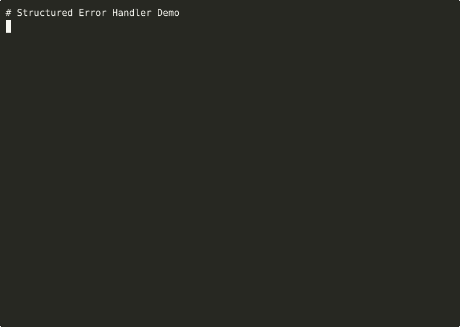

# Structured Error Handler / `serr`

[](https://github.com/tuulbelt/tuulbelt/actions/workflows/test-all-tools.yml)
[](https://github.com/tuulbelt/tuulbelt/actions)


[](LICENSE)

Structured error format with context preservation and serialization for debugging, logging, and error transmission.

## Problem

Standard JavaScript/TypeScript errors lose critical information when they propagate through call stacks:

- **Context loss**: When re-throwing errors, "what operation failed" is lost
- **Serialization issues**: Error objects don't serialize cleanly to JSON for logging
- **No cause chain**: Wrapping errors loses the original error information
- **Unstructured data**: Error messages mix metadata with human-readable text

This tool provides a structured error format that:

- Preserves operation context at each level of the call stack
- Serializes to clean JSON for logging, transmission, and debugging
- Maintains cause chains for root cause analysis
- Separates error codes, categories, and metadata from messages

## Features

- Zero runtime dependencies
- Works with Node.js 18+
- TypeScript support with strict mode
- Composable via CLI or library API
- Full JSON serialization/deserialization round-trip
- Context chain preservation through error wrapping
- Error codes and categories for programmatic handling
- Immutable error enrichment via `addContext()`

## Installation

Clone the repository:

```bash
git clone https://github.com/tuulbelt/tuulbelt.git
cd tuulbelt/structured-error-handler
npm install  # Install dev dependencies only
```

**CLI names** - both short and long forms work:
- Short (recommended): `serr`
- Long: `structured-error-handler`

**Recommended setup** - install globally for easy access:
```bash
npm link  # Enable the 'serr' command globally
serr --help
```

No runtime dependencies — this tool uses only Node.js standard library.

## Usage

### As a Library

```typescript
import { StructuredError, serializeError, formatError } from './src/index.js';

// Create a new structured error
const error = new StructuredError('Failed to process request', {
  code: 'VALIDATION_FAILED',
  category: 'validation',
  operation: 'validateInput',
  component: 'RequestHandler',
  metadata: { field: 'email', value: 'not-an-email' }
});

// Check error properties programmatically
if (error.hasCode('VALIDATION_FAILED')) {
  // Return 400 Bad Request
}

if (error.hasCategory('validation')) {
  // Log to validation dashboard
}

// Serialize for logging
console.log(JSON.stringify(error.toJSON(), null, 2));
```

### Wrapping Errors

```typescript
import { StructuredError } from './src/index.js';

async function fetchUserProfile(userId: string) {
  try {
    const user = await database.findUser(userId);
    return user;
  } catch (err) {
    throw StructuredError.wrap(err, 'Failed to fetch user profile', {
      code: 'USER_FETCH_FAILED',
      category: 'database',
      operation: 'fetchUserProfile',
      component: 'UserService',
      metadata: { userId }
    });
  }
}
```

### Adding Context

```typescript
// Add context as errors propagate up the call stack
const enrichedError = error.addContext('handleRequest', {
  component: 'APIController',
  metadata: { endpoint: '/api/users/123' }
});

// Context is stored most recent first:
// enrichedError.context[0] = handleRequest (most recent)
// enrichedError.context[1] = fetchUserProfile (earlier)
```

### As a CLI

```bash
# Show a demo of structured errors
serr demo

# Demo with text format
serr demo --format text

# Parse and format a JSON error
serr parse '{"message":"test error","code":"TEST","context":[]}'

# Validate JSON error format
serr validate '{"message":"test"}'

# Show help
serr --help
```

## CLI Options

- `demo` — Show a demo of structured errors with context chaining
- `parse <json>` — Parse a JSON error and format it
- `validate <json>` — Validate JSON error format
- `-f, --format <format>` — Output format: `json` or `text` (default: `json`)
- `-s, --stack` — Include stack traces in output
- `-h, --help` — Show help message

## Output Format

### JSON Output

```json
{
  "name": "StructuredError",
  "message": "Failed to fetch user profile",
  "code": "USER_FETCH_FAILED",
  "category": "database",
  "context": [
    {
      "operation": "handleRequest",
      "component": "APIController",
      "metadata": { "endpoint": "/api/users/123" },
      "timestamp": "2025-12-26T12:00:00.000Z"
    },
    {
      "operation": "fetchUserProfile",
      "component": "UserService",
      "metadata": { "userId": "123" },
      "timestamp": "2025-12-26T11:59:59.500Z"
    }
  ],
  "cause": {
    "name": "Error",
    "message": "Connection refused",
    "context": []
  }
}
```

### Text Output

```
[USER_FETCH_FAILED] Failed to fetch user profile

Context:
  → handleRequest (APIController) {"endpoint":"/api/users/123"}
  → fetchUserProfile (UserService) {"userId":"123"}

Caused by:
  Connection refused
```

## API

### `StructuredError` Class

#### Constructor

```typescript
new StructuredError(message: string, options?: StructuredErrorOptions)
```

**Options:**
- `code` — Error code for programmatic handling (e.g., `'ENOENT'`, `'VALIDATION_FAILED'`)
- `category` — Error category for grouping (e.g., `'io'`, `'validation'`, `'network'`)
- `operation` — The operation being performed when error occurred
- `component` — Component or module name
- `metadata` — Additional metadata (must be JSON-serializable)
- `cause` — The underlying cause (another error)

#### Methods

| Method | Description |
|--------|-------------|
| `addContext(operation, options?)` | Add context to error (returns new StructuredError) |
| `toJSON()` | Serialize to JSON-compatible object |
| `toString()` | Format for human-readable output |
| `getRootCause()` | Get the deepest error in the cause chain |
| `getCauseChain()` | Get all errors in the cause chain as array |
| `hasCode(code)` | Check if error or any cause matches code |
| `hasCategory(category)` | Check if error or any cause matches category |

#### Static Methods

| Method | Description |
|--------|-------------|
| `StructuredError.wrap(error, message, options?)` | Wrap an existing error with context |
| `StructuredError.from(error, options?)` | Convert any error to StructuredError |
| `StructuredError.fromJSON(json)` | Deserialize from JSON |
| `StructuredError.isStructuredError(error)` | Type guard for StructuredError |

### Helper Functions

```typescript
// Serialize any error to JSON format
serializeError(error: Error): SerializedError

// Deserialize back to Error/StructuredError
deserializeError(json: SerializedError): Error

// Format error for human-readable output
formatError(error: Error, options?: { includeStack?: boolean }): string
```

## Examples

See the `examples/` directory for runnable examples:

```bash
npx tsx examples/basic.ts     # Basic usage
npx tsx examples/advanced.ts  # Context chaining and cause analysis
```

### Example 1: Database Error Chain

```typescript
// Low-level database error
const dbError = new Error('Connection refused');

// Wrap with database context
const repoError = StructuredError.wrap(dbError, 'Failed to fetch user', {
  code: 'DB_ERROR',
  category: 'database',
  operation: 'findUserById',
  component: 'UserRepository',
  metadata: { userId: '123', timeout: 5000 }
});

// Wrap with service context
const serviceError = repoError.addContext('getUserProfile', {
  component: 'UserService',
  metadata: { includePreferences: true }
});

// Wrap with API context
const apiError = serviceError.addContext('handleGetUser', {
  component: 'UserController',
  metadata: { endpoint: '/api/users/123' }
});

// Serialize for logging
logger.error(apiError.toJSON());
```

### Example 2: Programmatic Error Handling

```typescript
try {
  await processOrder(orderId);
} catch (err) {
  const structured = StructuredError.from(err, {
    operation: 'processOrder',
    metadata: { orderId }
  });

  // Route based on error type
  if (structured.hasCategory('validation')) {
    res.status(400).json({ error: structured.message });
  } else if (structured.hasCategory('authorization')) {
    res.status(403).json({ error: 'Access denied' });
  } else {
    res.status(500).json({ error: 'Internal server error' });
  }

  // Log full context
  logger.error(structured.toJSON());
}
```

## Testing

```bash
npm test              # Run all tests
npm test -- --watch   # Watch mode
```

The test suite includes:
- Constructor and property tests
- Context chaining tests
- Error wrapping tests
- Serialization/deserialization round-trip tests
- Helper function tests
- CLI command tests
- Edge case handling tests

## Exit Codes

- `0` — Success
- `1` — Error (invalid input, parse failure, unknown command)

## Error Handling

Errors are structured and returned via the library API, not thrown. CLI errors are printed to stderr with appropriate exit codes.

## Specification

See [SPEC.md](SPEC.md) for detailed technical specification including:
- Core type definitions
- Serialization format
- Context chain ordering
- Behavior specifications
- Edge cases

## Dogfooding

### Validate This Tool's Tests

Run flakiness detection to validate test reliability:

```bash
./scripts/dogfood-flaky.sh 10
```

### Composition with Other Tools

**Output Diffing Utility** - Verify consistent serialization:
```bash
./scripts/dogfood-diff.sh
# Compares serialized error outputs to ensure consistency
```

See `DOGFOODING_STRATEGY.md` for implementation details.

## Future Enhancements

Potential improvements for future versions:

- Stack trace parsing for better cause chain formatting
- Integration with popular logging libraries (pino, winston)
- Custom serializers for non-JSON-serializable metadata
- Error aggregation for batch operations


## Demo



**[▶ View interactive recording on asciinema.org](https://asciinema.org/a/znP0oIxCxBv6BFUouS07ahB3A)**

> Try it online: [](https://stackblitz.com/github/tuulbelt/tuulbelt/tree/main/structured-error-handler)

## License

MIT — see [LICENSE](LICENSE)

## Contributing

See [CONTRIBUTING.md](../CONTRIBUTING.md) for contribution guidelines.

## Related Tools

Part of the [Tuulbelt](https://github.com/tuulbelt/tuulbelt) collection:
- [Test Flakiness Detector](../test-flakiness-detector/) — Detect unreliable tests
- [CLI Progress Reporting](../cli-progress-reporting/) — Concurrent-safe progress updates
- [Cross-Platform Path Normalizer](../cross-platform-path-normalizer/) — Path consistency
- [File-Based Semaphore](../file-based-semaphore/) — Cross-platform process locking
- [Output Diffing Utility](../output-diffing-utility/) — Semantic diff for JSON, text, binary
