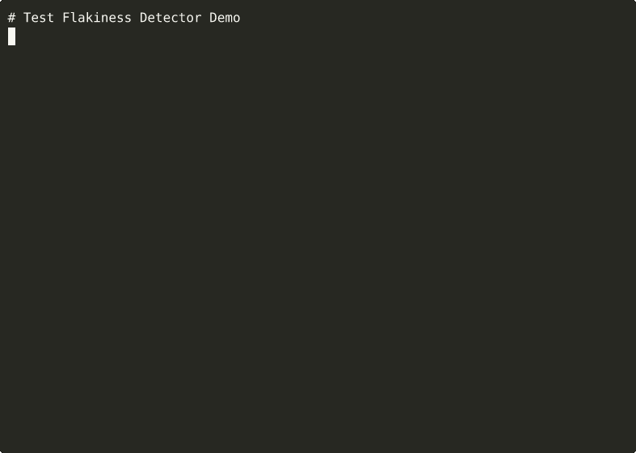

# Test Flakiness Detector

[](https://github.com/tuulbelt/tuulbelt/actions/workflows/test-all-tools.yml)
[](https://github.com/tuulbelt/tuulbelt/actions)


[](LICENSE)

Detect unreliable tests by running them multiple times and tracking failure rates.

## Problem

Flaky tests—tests that pass sometimes and fail sometimes—are a major pain in software development. They undermine confidence in test suites, cause false alarms in CI/CD pipelines, and waste developer time investigating spurious failures.

This tool runs your test command multiple times and identifies which tests have intermittent failures, helping you target and fix the real problems.

## Features

- Zero runtime dependencies
- Works with Node.js 18+
- TypeScript support with strict mode
- Composable via CLI or library API
- Works with any test command (npm test, cargo test, pytest, etc.)
- Configurable number of test runs
- Detailed JSON output with failure statistics
- Verbose mode for debugging

## Installation

Clone the repository:

```bash
git clone https://github.com/tuulbelt/tuulbelt.git
cd tuulbelt/test-flakiness-detector
npm install  # Install dev dependencies only
```

No runtime dependencies — this tool uses only Node.js standard library.

## Usage

### As a CLI

```bash
# Run npm test 10 times (default)
npx tsx src/index.ts --test "npm test"

# Run with 20 iterations
npx tsx src/index.ts --test "npm test" --runs 20

# Run cargo tests with verbose output
npx tsx src/index.ts --test "cargo test" --runs 15 --verbose

# Show help
npx tsx src/index.ts --help
```

### As a Library

```typescript
import { detectFlakiness } from './src/index.js';

const report = detectFlakiness({
  testCommand: 'npm test',
  runs: 10,
  verbose: false
});

if (report.success) {
  console.log(`Total runs: ${report.totalRuns}`);
  console.log(`Passed: ${report.passedRuns}, Failed: ${report.failedRuns}`);

  if (report.flakyTests.length > 0) {
    console.log('\nFlaky tests detected:');
    report.flakyTests.forEach(test => {
      console.log(`  ${test.testName}: ${test.failureRate.toFixed(1)}% failure rate`);
      console.log(`    Passed: ${test.passed}/${test.totalRuns}`);
      console.log(`    Failed: ${test.failed}/${test.totalRuns}`);
    });
  } else {
    console.log('No flaky tests detected');
  }
} else {
  console.error(`Error: ${report.error}`);
}
```

## CLI Options

- `-t, --test <command>` — Test command to execute (required)
- `-r, --runs <number>` — Number of times to run the test (default: 10, max: 1000)
- `-v, --verbose` — Enable verbose output showing each test run
- `-h, --help` — Show help message

## Output Format

The tool outputs a JSON report with the following structure:

```json
{
  "success": true,
  "totalRuns": 10,
  "passedRuns": 7,
  "failedRuns": 3,
  "flakyTests": [
    {
      "testName": "Test Suite",
      "passed": 7,
      "failed": 3,
      "totalRuns": 10,
      "failureRate": 30.0
    }
  ],
  "runs": [
    {
      "success": true,
      "exitCode": 0,
      "stdout": "...",
      "stderr": ""
    }
    // ... more run results
  ]
}
```

## Exit Codes

- `0` — Detection completed successfully and no flaky tests found
- `1` — Either invalid arguments, execution error, or flaky tests detected

## Examples

### Detect Flaky npm Tests

```bash
npx tsx src/index.ts --test "npm test" --runs 20
```

### Detect Flaky Rust Tests

```bash
npx tsx src/index.ts --test "cargo test" --runs 15
```

### Detect Flaky Python Tests

```bash
npx tsx src/index.ts --test "pytest tests/" --runs 10
```

### With Verbose Output

```bash
npx tsx src/index.ts --test "npm test" --runs 5 --verbose
```

This will show:
```
[INFO] Running test command 5 times: npm test
[INFO] Run 1/5
[RUN] Executing: npm test
[INFO] Run 2/5
...
[INFO] Completed 5 runs: 4 passed, 1 failed
[WARN] Detected flaky tests!
```

## Example Outputs

See what to expect from the tool with these real examples:

<details>
<summary>📊 Example 1: All Tests Passing (click to expand)</summary>

```bash
npx tsx src/index.ts --test "echo 'test passed'" --runs 5
```

```json
{
  "success": true,
  "totalRuns": 5,
  "passedRuns": 5,
  "failedRuns": 0,
  "flakyTests": [],
  "runs": [
    {
      "success": true,
      "exitCode": 0,
      "stdout": "test passed\n",
      "stderr": ""
    }
    // ... 4 more successful runs
  ]
}
```

**Result:** ✅ No flaky tests detected. All 5 runs passed consistently.

</details>

<details>
<summary>📊 Example 2: All Tests Failing (click to expand)</summary>

```bash
npx tsx src/index.ts --test "exit 1" --runs 3
```

```json
{
  "success": true,
  "totalRuns": 3,
  "passedRuns": 0,
  "failedRuns": 3,
  "flakyTests": [],
  "runs": [
    {
      "success": false,
      "exitCode": 1,
      "stdout": "",
      "stderr": ""
    }
    // ... 2 more failed runs
  ]
}
```

**Result:** ✅ No flakiness detected. Tests fail consistently (not intermittent).

</details>

<details>
<summary>🔴 Example 3: Flaky Tests Detected (click to expand)</summary>

```bash
npx tsx src/index.ts --test 'node -e "process.exit(Math.random() > 0.5 ? 0 : 1)"' --runs 20
```

```json
{
  "success": true,
  "totalRuns": 20,
  "passedRuns": 11,
  "failedRuns": 9,
  "flakyTests": [
    {
      "testName": "Test Suite",
      "passed": 11,
      "failed": 9,
      "totalRuns": 20,
      "failureRate": 45.0
    }
  ],
  "runs": [
    // Mix of passing and failing runs
  ]
}
```

**Result:** ⚠️ **Flaky test detected!** 45% failure rate (9 failures out of 20 runs).
**Action:** This test needs investigation and fixing.

</details>

<details>
<summary>💬 Example 4: Verbose Mode Output (click to expand)</summary>

```bash
npx tsx src/index.ts --test "echo 'test'" --runs 3 --verbose
```

```
[INFO] Running test command 3 times: echo 'test'
[INFO] Run 1/3
[RUN] Executing: echo 'test'
[INFO] Run 2/3
[RUN] Executing: echo 'test'
[INFO] Run 3/3
[RUN] Executing: echo 'test'
[INFO] Completed 3 runs: 3 passed, 0 failed
{
  "success": true,
  "totalRuns": 3,
  "passedRuns": 3,
  "failedRuns": 0,
  "flakyTests": [],
  ...
}
```

**Result:** Shows detailed execution logs plus JSON output.

</details>

> **Note:** Example outputs are auto-generated and committed to [`examples/outputs/`](examples/outputs/) directory.
> See [`.github/workflows/update-demos.yml`](.github/workflows/update-demos.yml) for automation details.

## Try It Yourself

### Quick Start

```bash
git clone https://github.com/tuulbelt/tuulbelt.git
cd tuulbelt/test-flakiness-detector
npm install
npx tsx src/index.ts --test "npm test" --runs 10
```

### One-Click Playground

[](https://stackblitz.com/github/tuulbelt/tuulbelt/tree/main/test-flakiness-detector)

Try the tool instantly in your browser without installing anything!

## How It Works

1. The tool executes the specified test command N times
2. It captures the exit code, stdout, and stderr for each run
3. It tracks how many times the tests passed vs. failed
4. If some runs pass and some fail, the test suite is flagged as flaky
5. A detailed JSON report is generated with failure statistics

## Architecture

**Execution Strategy:**
1. Validate input (test command is non-empty string, runs are between 1-1000)
2. Execute test command synchronously N times using `child_process.execSync`
3. Capture exit code, stdout, and stderr for each execution
4. Record pass (exit code 0) or fail (non-zero exit code) for each run
5. Calculate flakiness: if passedRuns > 0 AND failedRuns > 0, tests are flaky
6. Generate comprehensive JSON report with all run results and statistics

**No external dependencies** — Uses only Node.js `child_process` module for command execution.

**Key Design Choices:**
- **Synchronous execution**: Tests run sequentially to avoid false flakiness from resource contention
- **Suite-level detection**: Tracks entire test command success/failure, not individual test names
- **No timeout**: Waits for command completion to avoid flagging slow tests as flaky
- **Result pattern**: Returns structured result object, never throws exceptions

## Testing

```bash
npm test              # Run all tests
npm test -- --watch   # Watch mode
```

The test suite includes:
- Basic functionality tests
- Input validation tests
- Flaky test detection tests
- Edge case handling tests
- Error scenario tests

## Error Handling

The tool handles various error scenarios gracefully:

- Invalid or non-existent commands
- Command syntax errors
- Commands that hang or timeout
- Empty or malformed input

Errors are returned in the `error` field of the result object, not thrown.

## Performance

- **Time complexity**: O(N × T) where N = number of runs, T = time per test execution
- **Space complexity**: O(N × S) where N = number of runs, S = size of stdout/stderr per run
- **Resource limits**:
  - Maximum runs: 1000 (configurable, prevents resource exhaustion)
  - Maximum buffer per run: 10MB (stdout + stderr combined)
  - No artificial timeout (waits for natural command completion)
- **Execution**: Sequential, not parallel (avoids false flakiness from resource contention)

## Limitations

- Currently detects flakiness at the test suite level (entire command pass/fail)
- Does not parse individual test names from test runner output
- Maximum of 1000 runs per detection (to prevent resource exhaustion)
- stdout/stderr buffer limited to 10MB per run

## Future Enhancements

Potential improvements for future versions:

- Parse individual test names from popular test runners (Jest, Mocha, pytest, cargo test)
- Track flakiness per individual test, not just test suite
- Calculate statistical confidence intervals for failure rates
- Support for parallel test execution to speed up detection
- Integration with CI/CD systems (GitHub Actions, GitLab CI)

## Specification

See [SPEC.md](SPEC.md) for detailed technical specification.


## Demo



**[▶ View interactive recording on asciinema.org](https://asciinema.org/a/WgUQsHvqswlUFvfJekVH07jXi)**

<div>
  <span style="display: inline-block; vertical-align: middle; margin-right: 8px;"><strong>Try it online:</strong></span>
  <a href="https://stackblitz.com/github/tuulbelt/tuulbelt/tree/main/test-flakiness-detector" style="display: inline-block; vertical-align: middle;">
    
  </a>
</div>

## License

MIT — see [LICENSE](LICENSE)

## Contributing

See [CONTRIBUTING.md](../CONTRIBUTING.md) for contribution guidelines.

## Related Tools

Part of the [Tuulbelt](https://github.com/tuulbelt/tuulbelt) collection:
- [CLI Progress Reporting](../cli-progress-reporting/) — Concurrent-safe progress updates
- More tools coming soon...
